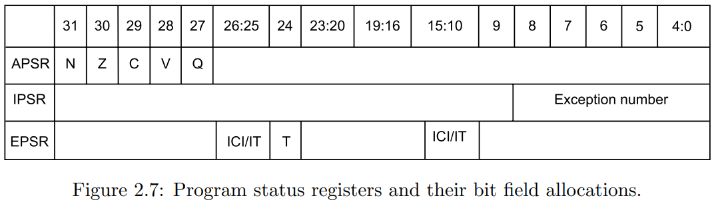

## 状态寄存器位标志

> These registers have special functions and can be accessed only by special instructions. They cannot be used for normal data processing. Figure 2.7 shows different bit fields used by program status register and the definitions of these bit fields are explained in Table 2.2. The negative flag denoted by N is set to 1 if the result of the previous operation carried out by the ALU was negative. In case the previous operation result was positive, or zero, then N becomes 0. If the zero flag denoted by Z is equal to 1, then it indicates that the previous operation result was zero. Otherwise, result of the previous operation was non-zero. If the previous addition operation resulted in a carry bit or the previous subtraction did not result in a borrow bit, then the carry flag becomes 1. Otherwise, C = 0. The overflow flag represented by V becomes a 1 when the previous operation resulted in an overflow. Otherwise, V flag is cleared. The DSP overflow and saturation flag denoted by Q will be set to 1 when DSP overflow or saturation has occurred. Otherwise, it is 0. From Figure 2.7, it can be observed that the bit field allocations in the three program status registers are done in such a way that they occupy non-overlapping bit locations. This permits us to combine these three registers into one register without affecting the functionality of each bit field
>
> 这些寄存器具有特殊功能，只能通过特殊指令访问。它们不能用于正常的数据处理。图2.7显示了程序状态寄存器使用的不同位字段，这些位字段的定义在表2.2中进行了解释。负标志N设置为1，如果ALU执行的前一个操作的结果为负数。如果前一个操作的结果是正数或零，则N变为0。如果零标志Z等于1，表示前一个操作的结果为零。否则，前一个操作的结果为非零。如果前一个加法操作导致进位位，或者前一个减法操作没有借位位，那么进位标志C变为1。否则，C=0。溢出标志V在前一个操作导致溢出时变为1。否则，V标志被清除。DSP溢出和饱和标志Q在DSP溢出或饱和发生时被设置为1。否则，它为0。从图2.7中可以观察到，这三个程序状态寄存器中的位字段分配是非重叠的。这允许我们将这三个寄存器合并为一个寄存器，而不影响每个位字段的功能。

- N 	: 只看结果的最高位，如果是1，则为负。也就是说把结果当有符号数。
- Z      : 如果结果为零，则为1。
- C      : 如果最高位向下一位进位，无论是加法还是减法，都变为1。因为减法也是加法操作，先变为原数的补码，再进行相加操作
- V      : 如果两个操作数的最高位相同，结果的最高位却不与它们一样，则为1。也就是说把操作当成有符号数操作。
