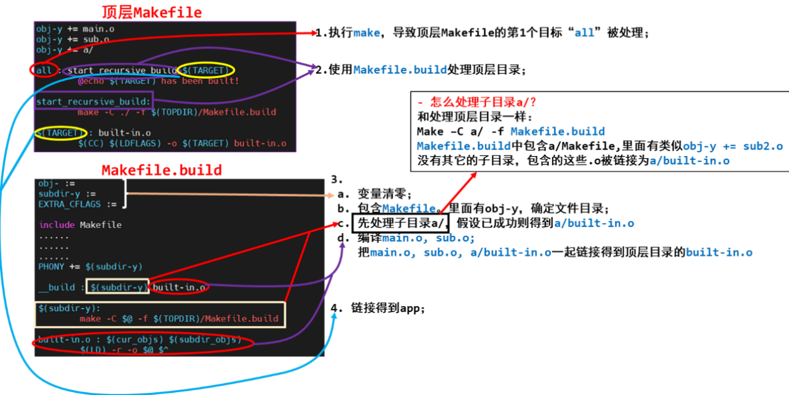

### 通用Makefle的解析

执行 make 命令时，它会去当前目录下查找名为“Makefile”的文件，并根据它的指示去执行操作，生成第一个目标。

- 我们可以使用“-f”选项指定文件，不再使用名为“Makefile”的文件， 比如：
  ```bash
  make -f Makefile.build 
  ```

- 我们可以使用“-C”选项指定目录，切换到其他目录里去，比如：
  ```bash
  make -C a/ -f Makefile.build 
  ```

- 我们可以指定目标，不再默认生成第一个目标：
  ```bash
  make -C a/ -f Makefile.build other_target
  ```

- 变量的导出(export)

  ```bash
  export CFLAGS LDFLAGS
  #使其他Makefile能用到前面已经执行的Makefile的变量，即其他Makefile由导出变量的Makefile调用执行
  ```

- Makefile 中可以使用 shell 命令：
  ```makefile
  TOPDIR := $(shell pwd)
  #这是个立即变量，TOPDIR 等于 shell 命令 pwd 的结果。
  ```

- 在 Makefile 中怎么放置第 1 个目标：
  执行 make 命令时如果不指定目标，那么它默认是去生成第 1 个目标。 所以“第 1 个目标”，位置很重要。有时候不太方便把第 1 个目标完整地放 在文件前面，这时可以在文件的前面直接放置目标，在后面再完善它的依赖与 命令。比如：

  ```bash
  First_target: # 这句话放在前面
   # 其他代码
  First_target : $(xxx)  #在后面来完善
  	$(command)
  ```

### 调用流程



