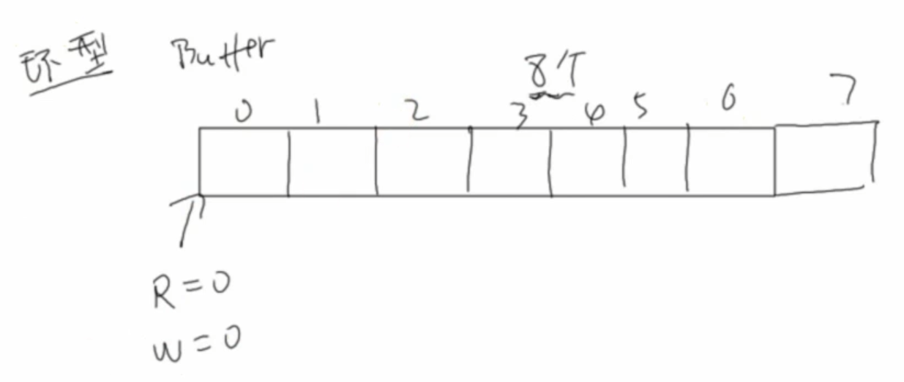

# 环形缓冲区




>环形缓冲区大小为8,最后一格为了区分"空"和"满"而不放入数据
>
>首先定义全局变量:
>
>```c
>int w = 0,r = 0;
>int data_buff[8] = {0};//环形缓冲区初始化为0
>```


- 判断环形缓冲区内是否有数据

  ```c
  //有数据返回0,没有数据返回-1
  int has_data()
  {
      if(w == r)
          return -1;
      else
          return 0;
  }
  ```

- 判断环形缓冲区是否已满

  ```c
  //未满返回0,已满返回-1
  int has_space()
  {
      if((w + 1) % 8 == r)
          return -1;
      else
          return 0;    
  }
  ```


- 写数据

  ```c
  //将数据写入到环形缓冲区内,成功返回0,失败返回-1
  int put_data(int *val)
  {
      //判断是否已满
      if(!has_space())
      {
          data_buff[w] = *val;
          w = (w + 1) % 8;
          return 0;
      }
      else
          return -1;
  }
  ```

- 读数据

  ```c
  //将数据从环形缓冲区读出,成功返回0,失败返回-1
  int get_data(int *val)
  {
      //判断是否为空
      if(!has_data())
      {
          *val = data_buff[r];
          r = (r + 1) % 8;
          return 0;
      }
      else
          return -1;
  }
  ```

  