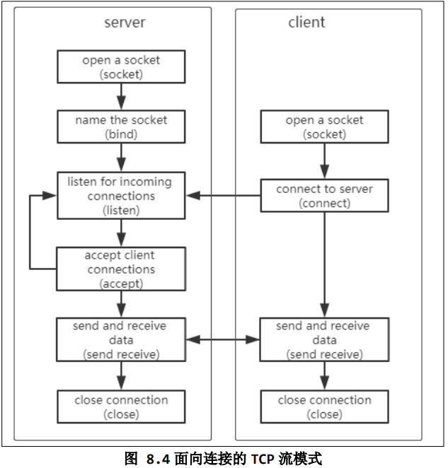

## TCP

- 一个进程可以有多个端口，即进程内多个套接字实现不同通信
- 一个端口可以对应多个进程，比如服务器的多个进程对应一个端口
- 每个套接字内部有一个缓冲区，套接字是通信的端点，而不是某一个端口或进程，只要套接字不同，即能够作为通信一方
- Linux内部通过五元组来区分套接字，即：源ip，目的ip，源端口，目的端口，通信协议UDP/TCP
- TCP通信前必须连接，交换控制信息，包括：序号，对方ip，端口等

-------

***服务器与多个客户端收发数据***



- sever程序需要绑定一个端口，ip可以任意，如果不绑定(bind)，端口将随机分配，这样客户端就无法知道服务器端口
- sever程序调用listen函数时会进入listen状态，accept建立连接时，会另返回一个套接字用于收发数据，最初创建的套接字一直是listen状态用于监听
- 一个套接字对应一个连接，使用多进程（fork函数）与客户端一一对应，这样简单些

*服务器程序：*

```c
#include <sys/types.h>        
#include <sys/socket.h>
#include <string.h>
#include <sys/socket.h>
#include <netinet/in.h>
#include <arpa/inet.h>
#include <unistd.h>
#include <stdio.h>
#include <signal.h>

/* socket
 * bind
 * listen
 * accept
 * send/recv
 */

#define SERVER_PORT 8888
#define BACKLOG     10

int main(int argc, char **argv)
{
	int iSocketServer;
	int iSocketClient;
	struct sockaddr_in tSocketServerAddr;
	struct sockaddr_in tSocketClientAddr;
	int iRet;
	int iAddrLen;

	int iRecvLen;
	unsigned char ucRecvBuf[1000];

	int iClientNum = -1;

	signal(SIGCHLD,SIG_IGN);//解决僵死进程的问题，否则子进程退出后会有僵死进程遗留
	
	iSocketServer = socket(AF_INET, SOCK_STREAM, 0);/* AF_INET:ipv4; SOCK_STREAM:TCP传输*/
	if (-1 == iSocketServer)
	{
		printf("socket error!\n");
		return -1;
	}

	tSocketServerAddr.sin_family      = AF_INET;/*AF_INET：ipv4*/
	tSocketServerAddr.sin_port        = htons(SERVER_PORT);  /* host to net, short */
 	tSocketServerAddr.sin_addr.s_addr = INADDR_ANY;/*本机上所有ip*/
	memset(tSocketServerAddr.sin_zero, 0, 8);
	
	iRet = bind(iSocketServer, (const struct sockaddr *)&tSocketServerAddr, sizeof(struct sockaddr));
	if (-1 == iRet)
	{
		printf("bind error!\n");
		return -1;
	}

	iRet = listen(iSocketServer, BACKLOG);/*BACKLOG:已挂起连接的最大数量,即没accept连接的最大数量*/
	if (-1 == iRet)
	{
		printf("listen error!\n");
		return -1;
	}

	while (1)
	{
		iAddrLen = sizeof(struct sockaddr);
		iSocketClient = accept(iSocketServer, (struct sockaddr *)&tSocketClientAddr, &iAddrLen);
		if (-1 != iSocketClient)
		{
			iClientNum++;
			printf("Get connect from client %d : %s\n",  iClientNum, inet_ntoa(tSocketClientAddr.sin_addr));
			if (!fork())/*fork创建进程，子进程返回0，父进程返回创建的进程号，子进程代码和父进程完全相同*/
			{
				/* 子进程的源码 */
				while (1)
				{
					/* 接收客户端发来的数据并显示出来 */
					iRecvLen = recv(iSocketClient, ucRecvBuf, 999, 0);/*阻塞等待，但客户端断开返回0*/
					if (iRecvLen <= 0)
					{
						close(iSocketClient);
						return -1;
					}
					else
					{
						ucRecvBuf[iRecvLen] = '\0';
						printf("Get Msg From Client %d: %s\n", iClientNum, ucRecvBuf);
					}
				}				
			}
		}
	}
	
	close(iSocketServer);
	return 0;
}

```

*客户端程序：*

```c
#include <sys/types.h>          
#include <sys/socket.h>
#include <string.h>
#include <sys/socket.h>
#include <netinet/in.h>
#include <arpa/inet.h>
#include <unistd.h>
#include <stdio.h>

/* socket
 * connect
 * send/recv
 */

#define SERVER_PORT 8888

int main(int argc, char **argv)
{
	int iSocketClient;
	struct sockaddr_in tSocketServerAddr;
	
	int iRet;
	unsigned char ucSendBuf[1000];
	int iSendLen;

	if (argc != 2)
	{
		printf("Usage:\n");
		printf("%s <server_ip>\n", argv[0]);
		return -1;
	}

	iSocketClient = socket(AF_INET, SOCK_STREAM, 0);

	tSocketServerAddr.sin_family      = AF_INET;
	tSocketServerAddr.sin_port        = htons(SERVER_PORT);  /* host to net, short */
 	//tSocketServerAddr.sin_addr.s_addr = INADDR_ANY;
 	if (0 == inet_aton(argv[1], &tSocketServerAddr.sin_addr))
 	{
		printf("invalid server_ip\n");
		return -1;
	}
	memset(tSocketServerAddr.sin_zero, 0, 8);


	iRet = connect(iSocketClient, (const struct sockaddr *)&tSocketServerAddr, sizeof(struct sockaddr));	
	if (-1 == iRet)
	{
		printf("connect error!\n");
		return -1;
	}

	while (1)
	{
		if (fgets(ucSendBuf, 999, stdin))
		{
			iSendLen = send(iSocketClient, ucSendBuf, strlen(ucSendBuf), 0);/*直接发送，不等待到一个MSS*/
			if (iSendLen <= 0)
			{
				close(iSocketClient);
				return -1;
			}
		}
	}
	
	return 0;
}
```

