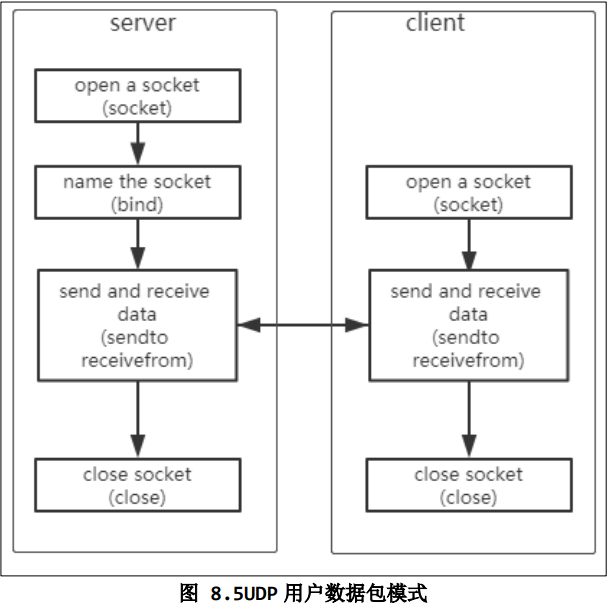

## UDP

- 套接字的目的ip，端口都是任意，因此只有源ip，端口二元组区分不同的套接字
- 可以接收任何发送方的数据，发送方信息并不保存在套接字中，不影响其他发送者的通信
- 不需要进行连接

---------

***服务器与多个客户端收发数据***



- 服务器和客户端没有区别，只要知道ip和端口就可以直接发数据
- 通常服务器绑定端口，否则客户端不知道服务器端口号

*服务器程序：*

```c
#include <sys/types.h>          
#include <sys/socket.h>
#include <string.h>
#include <sys/socket.h>
#include <netinet/in.h>
#include <arpa/inet.h>
#include <unistd.h>
#include <stdio.h>
#include <signal.h>


/* socket
 * bind
 * sendto/recvfrom
 */

#define SERVER_PORT 8888

int main(int argc, char **argv)
{
	int iSocketServer;
	struct sockaddr_in tSocketServerAddr;
	struct sockaddr_in tSocketClientAddr;
	int iRet;
	int iAddrLen;

	int iRecvLen;
	unsigned char ucRecvBuf[1000];

	int iClientNum = -1;
	
	iSocketServer = socket(AF_INET, SOCK_DGRAM, 0);/*SOCK_DGRAM:UDP传输*/
	if (-1 == iSocketServer)
	{
		printf("socket error!\n");
		return -1;
	}

	tSocketServerAddr.sin_family      = AF_INET;
	tSocketServerAddr.sin_port        = htons(SERVER_PORT);  /* host to net, short */
 	tSocketServerAddr.sin_addr.s_addr = INADDR_ANY;
	memset(tSocketServerAddr.sin_zero, 0, 8);
	
	iRet = bind(iSocketServer, (const struct sockaddr *)&tSocketServerAddr, sizeof(struct sockaddr));
	if (-1 == iRet)
	{
		printf("bind error!\n");
		return -1;
	}


	while (1)
	{
		iAddrLen = sizeof(struct sockaddr);
		iRecvLen = recvfrom(iSocketServer, ucRecvBuf, 999, 0, (struct sockaddr *)&tSocketClientAddr, &iAddrLen);/*阻塞等待,即使客户端断开仍继续，但收到空数据报返回0*/
		if (iRecvLen > 0)
		{
			ucRecvBuf[iRecvLen] = '\0';
			printf("Get Msg From %s : %s\n", inet_ntoa(tSocketClientAddr.sin_addr), ucRecvBuf);
		}
	}
	
	close(iSocketServer);
	return 0;
}

```

*客户端程序：*

```c
#include <sys/types.h>         
#include <sys/socket.h>
#include <string.h>
#include <sys/socket.h>
#include <netinet/in.h>
#include <arpa/inet.h>
#include <unistd.h>
#include <stdio.h>

/* socket
 * connect
 * sendto/recvfrom
 */

#define SERVER_PORT 8888

int main(int argc, char **argv)
{
	int iSocketClient;
	struct sockaddr_in tSocketServerAddr;
	
	int iRet;
	unsigned char ucSendBuf[1000];
	int iSendLen;
	int iAddrLen;

	if (argc != 2)
	{
		printf("Usage:\n");
		printf("%s <server_ip>\n", argv[0]);
		return -1;
	}

	iSocketClient = socket(AF_INET, SOCK_DGRAM, 0);

	tSocketServerAddr.sin_family      = AF_INET;
	tSocketServerAddr.sin_port        = htons(SERVER_PORT);  /* host to net, short */
 	//tSocketServerAddr.sin_addr.s_addr = INADDR_ANY;
 	if (0 == inet_aton(argv[1], &tSocketServerAddr.sin_addr))
 	{
		printf("invalid server_ip\n");
		return -1;
	}
	memset(tSocketServerAddr.sin_zero, 0, 8);

	while (1)
	{
		if (fgets(ucSendBuf, 999, stdin))
		{

			iAddrLen = sizeof(struct sockaddr);
			iSendLen = sendto(iSocketClient, ucSendBuf, strlen(ucSendBuf), 0,
			                      (const struct sockaddr *)&tSocketServerAddr, iAddrLen);/*直接发送，不等待到MSS*/

			if (iSendLen <= 0)
			{
				close(iSocketClient);
				return -1;
			}
		}
	}
	
	return 0;
}


```


