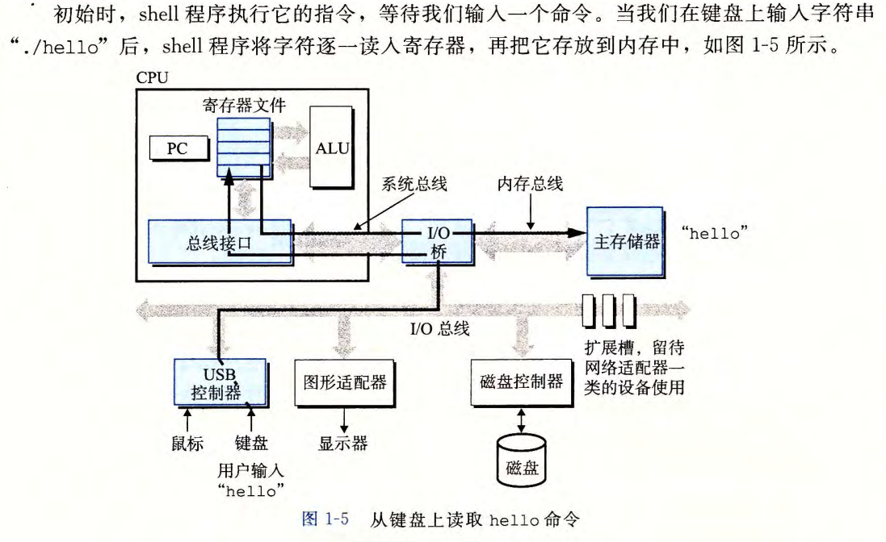
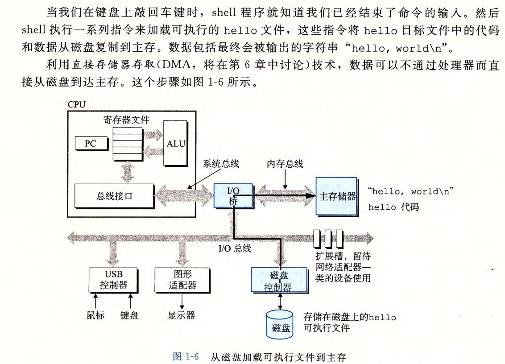
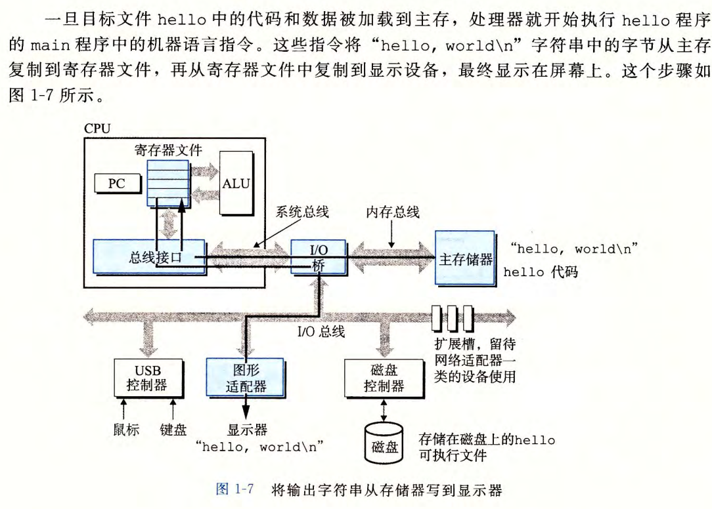
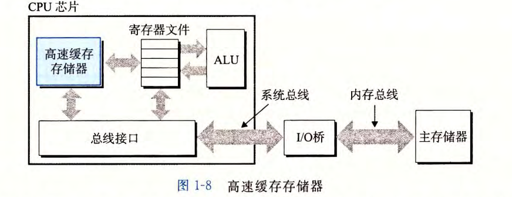
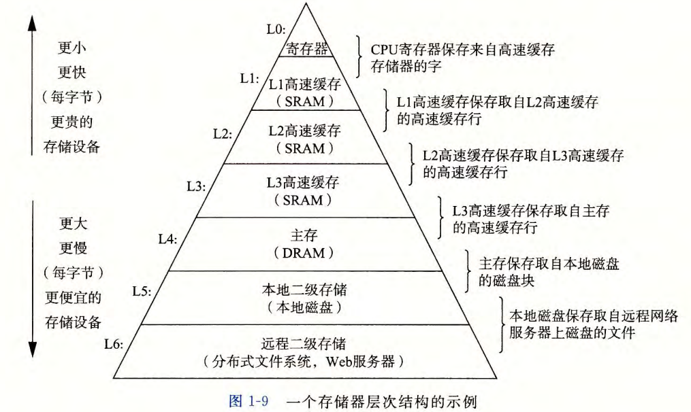
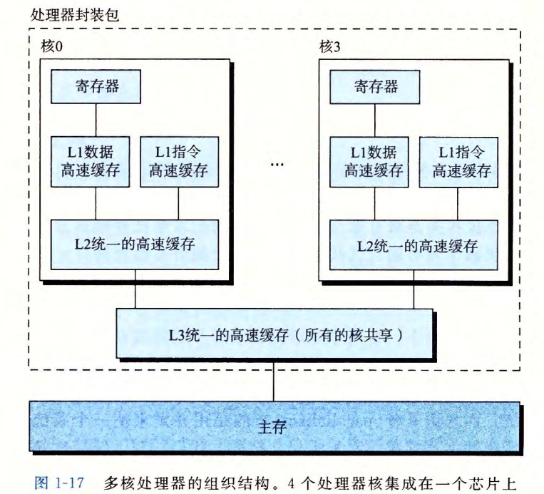
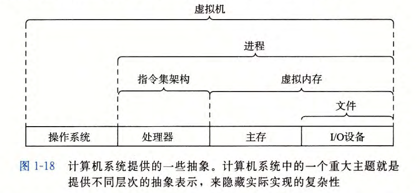
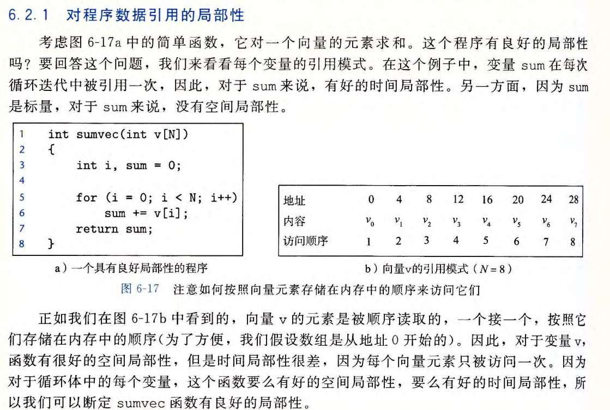
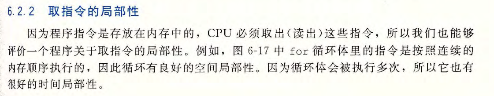

# 计算机系统基础

### linux运行hello程序

*** 系统花费大量时间将内存中的程序和数据复制到寄存器中，然而，cpu处理寄存器的数据比数据从主存加载到寄存器快很多倍，因此，高速缓存至关重要，良好的程序具有局部性，即程序具有访问局部区域里的数据和代码的趋势，先加载一块数据到高速缓存（cache），接下来的大部分内存操作都可以在高速缓存执行（利用局部性原理）***

### 存储器的层次结构

### 多核处理器（多个cpu集成在一个芯片上）

***并发：通过时间片轮转同时执行多个任务***

***并行：通过过cpu的方式执行多个任务***

### 计算机系统抽象

### 局部性

- ***时间局部性：被引用过一次的内存位置很可能在不远的将来再被多次引用。***
- ***空间局部性：如果一个内存位置被引用了一次，那么程序很可能再不远的将来引用附件的一个内存位置***

